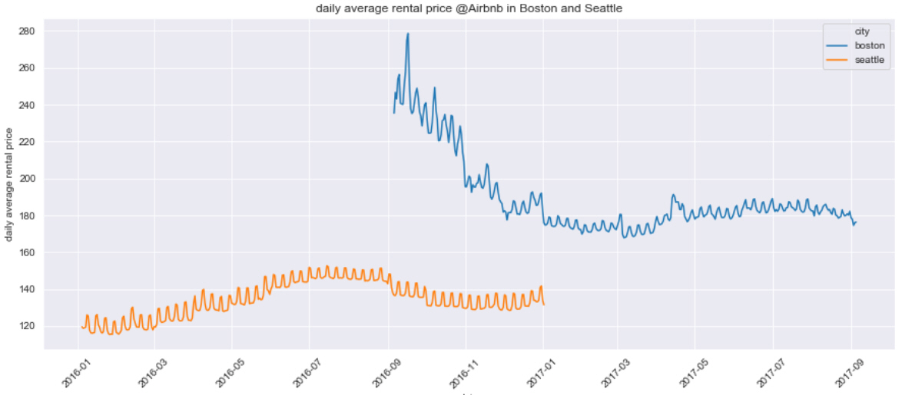
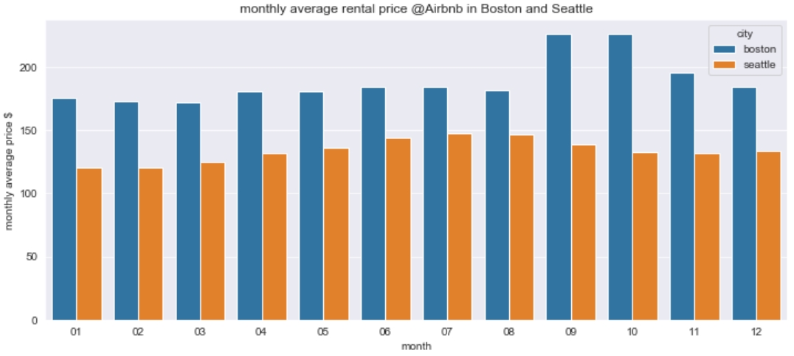
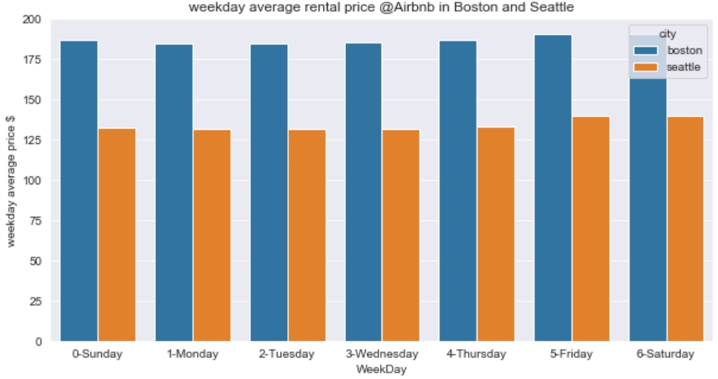

[Boston and Seattle Airbnb Data Analysis](#Boston-and-Seattle-airbnb-data-analysis)
  - [Introduction](#Introduction)
  - [Installation](#installation)
  - [File Descriptions](#file-descriptions)
  - [Results](#results)
  - [Licensing, Authors, Acknowledgements](#licensing-authors-acknowledgements)

## Introduction
This analysis focuses on Airbnb listing price in Boston and Seattle and tries to answer questions below:
1. Is there any trend in Airbnb listing price? How does price compare between Boston and Seattle?
2. Should you become a superhost?
3. What factors affect the Airbnb listing price?

Please check my **[blog post](https://medium.com/@ustcdj/wanna-make-more-money-on-airbnb-e7549453d5b0)** for more details.

The link to the detailed codes:
**[`Airbnb.ipynb`](https://github.com/ustcdj/Airbnb_Pricing/blob/master/Airbnb.ipynb)**

## Installation
The code was developed using the Anaconda distribution of Python, versions 3.8.1. Python libraries used are `numpy`, `pandas`, `datetime`, `matplotlib`, `seaborn`, `sklearn`, `random`, `re`.

## Analysis
The Seattle and Boston Airbnb datasets are from Kaggle. The Seattle dataset has 3818 records and the Boston dataset has 3585 records. The `feat_info.csv` file has necessary actions for each independent variable during the data preparation step.

- Preprocessing
 - Drop features that have high correlations with other features.
 - Drop records that have ridiculously high listing price.
 - Drop rows with more than 30% missing values.
 - Impute nulls with mean for numeric features and mode for integer/fixed values.
 - OneHotEncoder categorical features.
 - Scale features with StandardScaler.
- Split the data into train and test
- Use LassoCV to perform feature selection and to find best model (alpha) automatically

## Results
### 1. Trend
  

Within the same period (Sep 6, 2016 to Jan 2, 2017), daily average listing price is higher in Boston ($191) than in Seattle ($136).

  

Daily average listing price in both Seattle and Boston shows a strong seasonal pattern:
- relatively low at the beginning of the year
- gradually increases as the season enters summer
- highest in summer for Seattle
- highest in fall for Boston

  
Daily average listing price in both Seattle and Boston shows a strong weekday pattern:
- slightly high on Friday and Saturday, close to $6~$7 more than the  average.

### 2. Superhosts
Compared to regular hosts, superhosts in both cities tend to:
- have on average 1 more review per month.
- charge extra_people.
- offer more services/amenities.
- are more pet friendly.
- Pets live on this property.
- require guest_profile_picture.

### 3. Important factors
For both cities, top factors are:
- neighbourhood or location
- capacity, such as bedrooms, bathrooms, beds, accomodates, guest_included
- host_is_superhost, calendar_updated
- amenity — Doorman etc.

## Licensing, Authors, Acknowledgements
Please find the Licensing for the dataset at Kaggle [Boston data](https://www.kaggle.com/airbnb/boston/data) and [Seattle data](https://www.kaggle.com/airbnb/seattle/data). Other than that, feel free to play with the code here.
